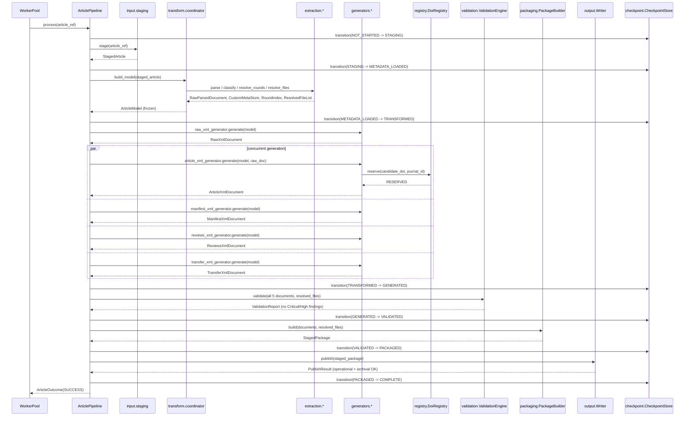
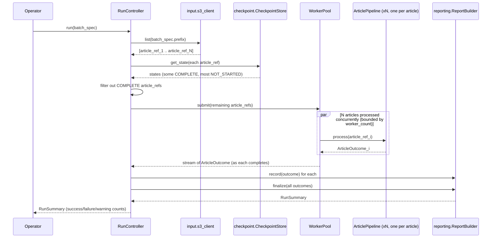
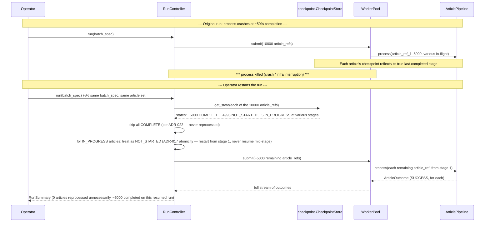

# Low-Level Design — Part 6: Sequence Diagrams

Mermaid `sequenceDiagram` syntax (renders in GitHub, VSCode with a Mermaid extension, and any Mermaid-aware viewer). Diagrams trace the module interactions defined in Parts 1–4; no new behavior is introduced here beyond what those parts already specify.

---

## 14.1 Single Article — Happy Path



---

## 14.2 Batch Processing



---

## 14.3 Error Recovery — Transient Failure With Successful Retry, Then a Permanent Failure Escalation

```mermaid
sequenceDiagram
    participant AP as ArticlePipeline
    participant OUT as output.Writer
    participant RT as retry.decorators
    participant RCV as recovery.RecoveryPolicy
    participant CKP as checkpoint.CheckpointStore
    participant HRQ as Human Review Queue

    Note over AP,OUT: --- Scenario A: transient failure, auto-recovered ---
    AP->>OUT: publish(staged_package)
    OUT-->>RT: raises S3WriteTransientError
    RT->>RT: classify -> retryable
    RT->>RT: backoff (attempt 1)
    RT->>OUT: publish(staged_package) [retry]
    OUT-->>RT: success
    RT-->>AP: PublishResult (OK, after 1 retry)
    AP->>CKP: transition(... -> COMPLETE)

    Note over AP,HRQ: --- Scenario B: same article, a different failure, non-retryable ---
    AP->>OUT: publish(staged_package) [different article]
    OUT-->>RT: raises FileReferenceMissingError (surfaced earlier, at extraction, illustrative here)
    RT->>RT: classify -> non-retryable
    RT-->>RCV: ClassifiedFailure(non-retryable)
    RCV->>CKP: transition(... -> FAILED)
    RCV->>HRQ: enqueue(article_id, failure_detail)
    RCV-->>AP: RecoveryAction.NO_RETRY
    AP-->>AP: (this article ends here; batch continues with other articles per WorkerPool isolation)
```

---

## 14.4 Restart Processing — Batch Killed Mid-Run, Then Resumed



**Design note reflected in 14.4:** per ADR-017 (package atomicity) and the discussion in Part 4 §9.5, an `IN_PROGRESS` article on restart is **always redone from the beginning**, never resumed mid-stage — this is a deliberate simplicity choice: since no partial package can ever have been published (ADR-017), the only cost of restarting-from-scratch is re-doing already-cheap, already-idempotent extraction/generation work, which is far simpler and safer than trying to resume a partially-built in-memory `ArticleModel` across a process restart.
