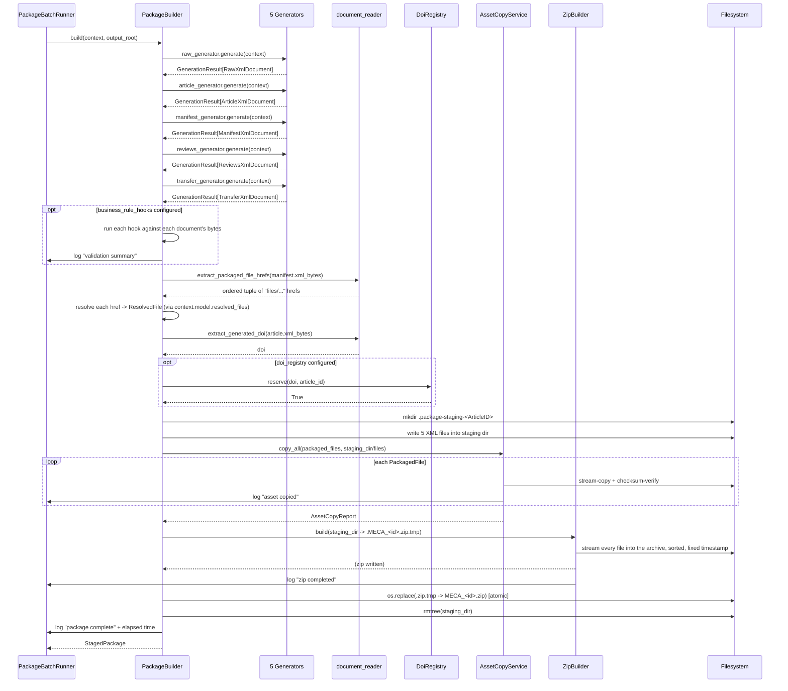
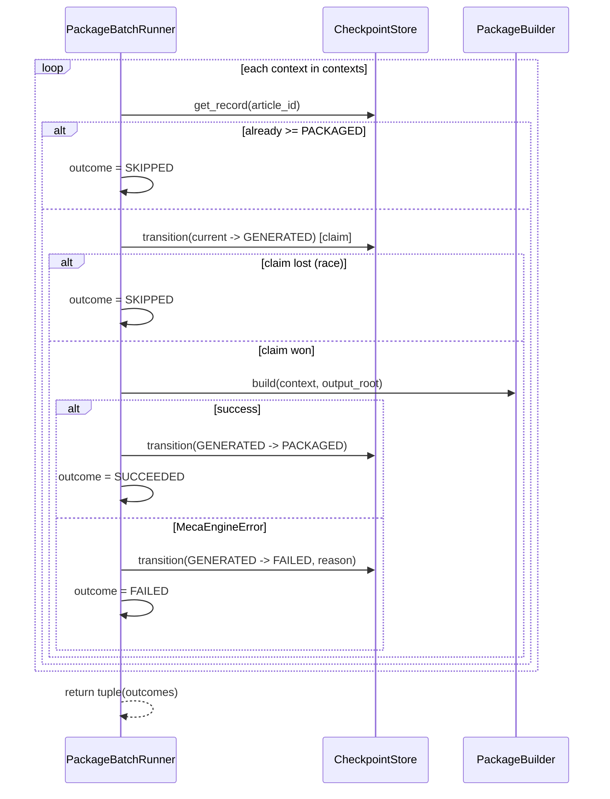

# Package Assembly Sequence Diagram — Milestone 7

Matches the style of `15_LLD_06_SEQUENCE_DIAGRAMS.md`. Two diagrams:
the single-article happy path (this milestone's own scope), and the
failure/atomicity path.

## 1. Single-article happy path



## 2. Failure / atomicity path (any step after generation)

```mermaid
sequenceDiagram
    participant Caller as PackageBatchRunner
    participant PB as PackageBuilder
    participant FS as Filesystem

    Caller->>PB: build(context, output_root)
    Note over PB: any step raises —<br/>generator failure, DOI collision,<br/>unresolvable href, copy failure,<br/>or zip-write failure
    PB->>PB: except BaseException
    PB->>FS: rmtree(.package-staging-<id>, ignore_errors=True)
    PB->>FS: unlink(.MECA_<id>.zip.tmp) if it exists
    PB->>Caller: log "package failed" + elapsed time
    PB-->>Caller: re-raise original exception unchanged
    Note over Caller: no MECA_<id>.zip,<br/>no staging dir,<br/>no .tmp file — ever
    Caller->>Caller: checkpoint.transition(GENERATED -> FAILED, reason)
    Caller->>Caller: record PackageOutcome(FAILED); continue to next article
```

## 3. Batch flow (composing §1/§2 across many articles)


